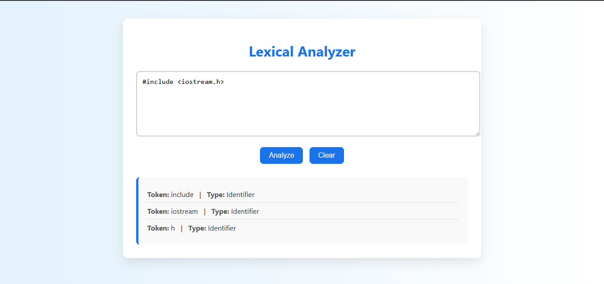

# 💻 Lexical Analyzer

This is a simple **Lexical Analyzer** web application built with HTML, CSS, and JavaScript. It takes source code as input and tokenizes it into keywords, identifiers, operators, numbers, and separators.

---

## 🚀 Features

- Intuitive and clean UI
- Tokenizes code input using regex
- Classifies tokens into:
  - Keywords
  - Identifiers
  - Operators
  - Numbers
  - Separators
- Clear and responsive design
- "Analyze" and "Clear" functionalities

---

## 🖼️ Preview

---

---

## 🧠 How It Works

The app uses regular expressions to identify different token types from the input text. Tokens are categorized into:
- **Keywords:** e.g., `int`, `float`, `if`, `else`, `while`, `return`
- **Identifiers:** Variable and function names
- **Numbers:** Integers (e.g., `123`)
- **Operators:** `+`, `-`, `*`, `/`, `=`
- **Separators:** `(`, `)`, `{`, `}`, `;`

---

## 📁 Project Structure

LexicalAnalyzer/
├── index.html          # Main HTML file
├── styles.css          # Styling for the UI
├── assets/
│   └── screenshot.png  # Screenshot of the web app (optional)
└── README.md           # Project documentation

